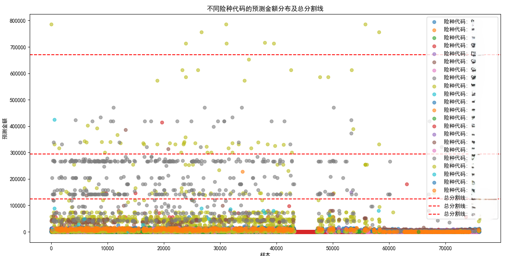

## Catboost

### 简介
在机器学习领域，CatBoost 是一款强大的梯度提升框架，它擅长处理带有类别特征的数据，并且在避免过拟合和处理缺失值等方面表现出色。本文将介绍如何使用 CatBoost 模型来解决分类和回归问题，解释其背后的原理，并展示如何对结果进行可视化。

我们将以一个脱敏后的保险数据集为例，该数据集包含多个特征字段，用于预测：

回归任务：根据输入特征预测保险索赔的金额。
分类任务：根据输入特征判断是否需要调查保险案件。

### CatBoost 模型简介
CatBoost 是一种基于决策树的梯度提升算法。与其他传统的树模型（如 XGBoost 和 LightGBM）相比，CatBoost 具有以下优势：

处理类别特征：不需要对类别特征进行独热编码（One-Hot Encoding），能够直接处理这些特征，避免数据膨胀。
对缺失值的鲁棒性：CatBoost 对缺失值处理较好，不需要特殊预处理。
防止过拟合：内置了多种正则化手段，防止过拟合。

### 其他说明
这里存储的是Catboost模型（分类 + 回归）训练及可视化代码(展示预测金额的和实际金额的散点折线图+字段重要性)。

draw_line: 应用KNN聚类取中心划线，然后进行可视化。

由于数据集敏感，所以不能放出来。

但是可以迁移到其他任意表格数据集上。指定一下 类别特征 + 数值特征 + 标签即可。

### 实现效果

### 赞助

如果对你有帮助，也欢迎请我喝杯咖啡。

