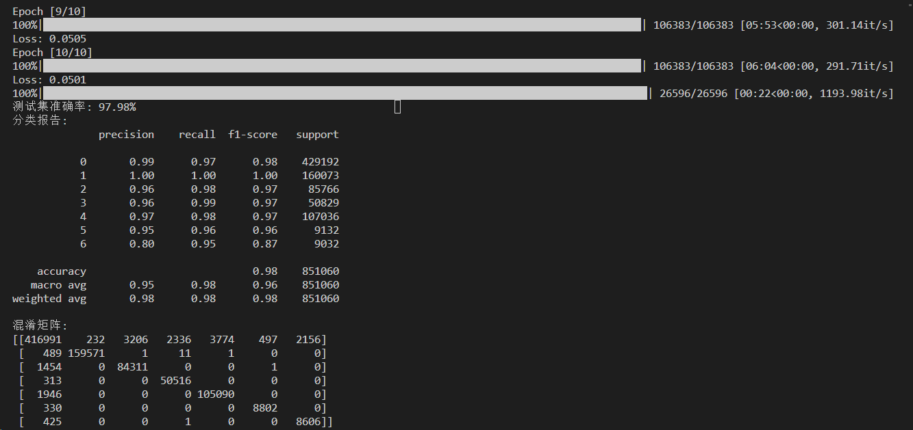

# WESAD


数据集下载地址：https://uni-siegen.sciebo.de/s/HGdUkoNlW1Ub0Gx

### WESAD 数据集概述

WESAD（WEarable Stress and Affect Detection）数据集是一套用于检测穿戴式设备记录的压力和情感数据的多模态数据集。它包含17名受试者的数据，但由于传感器故障，丢失了两名受试者的数据（S1 和 S12），因此总共包括15名受试者的数据。每个受试者的数据存储在一个独立的文件夹中，这些文件夹内包含多种文件和数据格式。

#### 数据集结构
每个受试者的文件夹包含以下文件：
- `SX_readme.txt`: 包含关于受试者（SX）和数据收集的详细信息。
- `SX_quest.csv`: 包含获取地面真值的所有相关信息，包括协议安排和自我报告问卷的答案。
- `SX_respiban.txt`: 包含 RespiBAN 设备的数据。
- `SX_E4_Data.zip`: 包含 Empatica E4 设备的数据。
- `SX.pkl`: 包含同步的传感器数据和标签。

#### 数据格式
- **RespiBAN 数据**:
  - RespiBAN Professional 设备记录的数据，每秒采样700次。文件包含10列数据，其中3-10列是8个传感器通道的原始数据。
  - 数据需要转换为SI单位，根据不同的传感器有不同的转换公式。
  
- **Empatica E4 数据**:
  - 设备佩戴在非主导手腕上，不同传感器的采样率不同。
  - 文件 `SX_E4_Data.zip` 解压后包含不同传感器的数据文件，例如加速度计（ACC.csv，32 Hz），光电容积描记法（BVP.csv，64 Hz），皮肤电活动（EDA.csv，4 Hz）和温度（TEMP.csv，4 Hz）。

- **同步数据**:
  - 使用双击信号模式手动同步两台设备的原始数据，结果存储在 `SX.pkl` 文件中。该文件是一个字典，包含两个字段：'chest'（RespiBAN数据）和'wrist'（Empatica E4数据），以及'labels'（标记研究协议条件的标签）。

#### 地面真值
所有相关信息存储在 `SX_quest.csv` 文件中，包含协议条件标签或自我报告问卷的答案。

### 使用WESAD数据集进行机器学习

在机器学习应用中，可以使用WESAD数据集进行情感分类、压力检测等任务。常见的步骤包括：
1. **数据预处理**：包括数据清理、特征提取、数据同步等。
2. **特征工程**：使用PCA、标准化等方法对数据进行降维和标准化处理。
3. **模型训练**：使用传统机器学习算法（如SVM、Random Forest）或深度学习算法（如神经网络）进行模型训练。
4. **模型评估**：评估模型的性能，使用指标如准确率、F1分数等。


```bash
E:.
│  .gitignore
│  index.ipynb
│  index.py
│  README.md
│
└─WESAD
    │  wesad_readme.pdf
    │
    ├─S10
    │      S10.pkl
    │      S10_E4_Data.zip
    │      S10_quest.csv
    │      S10_readme.txt
    │      S10_respiban.txt
    │
    ├─S11
    │      S11.pkl
    │      S11_E4_Data.zip
    │      S11_quest.csv
    │      S11_readme.txt
    │      S11_respiban.txt
    ...
```


index.py 执行结果



Q：

- 不同维度的数据采集时间是否一致，长度不同，选择长度截断、空白填充、还是线性插值、拷贝映射呢？
- 预处理数据的时候是否可以不用flatten展平，而是将其视作一个三维的向量呢作为一个特征呢？