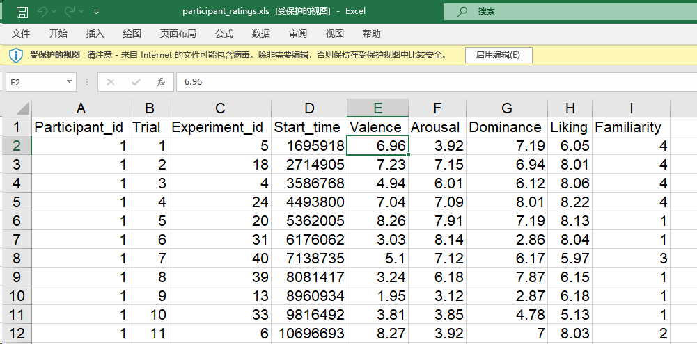

Machine Learning Classification of DEAP dataset 

dataset_url:https://www.kaggle.com/datasets/hmelmoth/deap-dataset

数据集说明：

1. https://cloud.tencent.com/developer/article/1653202

2. https://blog.csdn.net/weixin_44878336/article/details/132541982


### 想法

1. nbdt 需要基于一个预训练模型（似乎都是CNN），这个预训练模型是选用它内置的一些模型比如ResNet50这种吗？还是自己构建一个简单的几层神经网络。
2. nbdt的数据集支持的似乎也是那几个图片分类的，CIFAR10 CIFA100 ImageNet

- 尝试迁移来做，但是生成induce hierarchy的时候需要设置前面两个，似乎没看到自定义的配置项？

3. deap数据虽然说是观测音视频（多模态）下的情感分析数据，但是通过坐着的预处理后实际上就是很纯正机器学习数据了。
可以借助sklearn做数据集划分，ML方法预测等。


## DAAP 数据集

```
├─DEAP_dataset
│  ├─audio_stimuli_MIDI
│  ├─audio_stimuli_MIDI_tempo24
│  ├─data_preprocessed_python
│  ├─Metadata
│  └─metadata_xls
```

### 目录

1. **audio_stimuli_MIDI**:
   - 包含用于实验的音频刺激的MIDI文件。这些MIDI文件是实验中播放给参与者的音乐片段，用于引发不同的情感反应。
2. **audio_stimuli_MIDI_tempo24**:
   - 与`audio_stimuli_MIDI`类似，但这些MIDI文件经过了节奏调整（tempo调整到24），用于进一步的实验研究或比较不同节奏对情感反应的影响。
3. **data_preprocessed_python**:
   - 包含预处理后的数据，格式为Python可读取的文件。每个文件对应一个参与者，包含其观看视频时记录的EEG和生理信号数据。这些数据经过了基本的预处理，如滤波和标准化，以便于后续的分析和建模。
4. **Metadata**:
   - 包含与实验和数据集相关的元数据文件。这些文件可能包括实验设计、参与者信息、视频刺激的详细信息等，有助于理解和解释数据集中的记录。
5. **metadata_xls**:
   - 包含以Excel格式保存的元数据文件，如`participants_rating.xls`。这些文件记录了每个参与者对视频的情感评分（例如效价、觉醒度、支配感、喜欢程度和熟悉度）和实验相关的其他信息。


#### participant_ratings.xls

1. **Participant_id**：参与者的唯一标识符。例如，1表示第一个参与者。
2. **Trial**：实验中的试次编号。每个参与者观看多个视频，这里表示第几次试验。例如，1表示第一次试验。
3. **Experiment_id**：实验的唯一标识符，标识具体的实验。例如，5、18和4表示不同的实验。
4. **Start_time**：视频开始的时间戳，以毫秒为单位。表示视频片段的起始时间。
5. **Valence**：效价评分，表示情感的积极或消极程度。评分范围通常为1到9，数字越高表示越积极。
6. **Arousal**：觉醒度评分，表示情感的激动程度。评分范围通常为1到9，数字越高表示情绪越激动。
7. **Dominance**：支配感评分，表示参与者在情感状态下的控制感。评分范围通常为1到9，数字越高表示越有控制感。
8. **Liking**：喜欢程度评分，表示参与者对视频的喜欢程度。评分范围通常为1到9，数字越高表示越喜欢。
9. **Familiarity**：熟悉度评分，表示参与者对视频内容的熟悉程度。评分范围通常为1到9，数字越高表示越熟悉。




### 说明

生理信号采用512Hz采样，128Hz复采样（官方提供了经过预处理的复采样数据）每个被试者的生理信号矩阵为40*40*8064（40首实验音乐，40导生理信号通道，8064个采样点）其中40首音乐均为时长1分钟的不同种类音乐视频，40导生理信号包括10-20系统下32导脑电信号、2 导眼电信号（1导水平眼电信号，1导竖直眼电信号）[眼电信号EOG]、2导肌电信号（EMG）、1导GSR信号（皮电）、1导呼吸带信号、1导体积描记器、1导体温记录信号。8064则是128Hz采样率下63s的数据，每一段信号记录前，都有3s静默时间。

